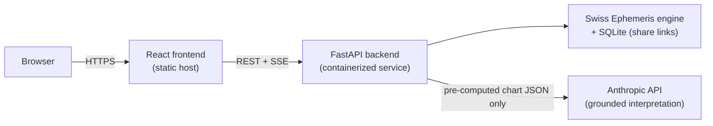

# AstroTruth

**A Vedic astrology app that separates computation from narration — the
math is deterministic, the language is generated, and neither one is
allowed to touch the other's job.**

🔗 **[Live demo](https://astrotruth.vercel.app)**

## Why this exists

Ask a general-purpose LLM to read a birth chart and it will happily invent
one: a plausible Mars in the seventh house, a Saturn dasha with confident
start and end dates, a yoga that doesn't exist in the actual planetary
positions. It isn't lying — it was never given the real chart, so it
pattern-matches what a chart interpretation *sounds like* and asserts it
as fact. Fluent and wrong look identical from the outside, and the reader
has no independent way to check.

AstroTruth is built to make that failure mode structurally impossible. A
pure, deterministic engine computes every planetary position, house, and
dasha period from the Swiss Ephemeris. The LLM is only ever handed that
already-computed JSON and asked to narrate it — it is never given the
opportunity to guess a placement, because it is never asked to know one.

## The golden rule

> **The LLM never computes. The engine never interprets.**

Data flows one direction: `engine → JSON → LLM`. The engine
(`backend/app/engine.py`, `backend/app/dasha.py`) is pure functions with
no I/O and no knowledge that an LLM layer exists. The LLM layer
(`backend/app/interpret.py`) never recomputes a position — every
astrological claim it makes must trace back to a field already present in
the chart JSON, and a [grounding eval](#evals) checks that mechanically.

## Architecture



The frontend never talks to Anthropic directly, and the engine has no
dependency on the LLM layer at all — you could delete `interpret.py`
entirely and the chart computation would be unaffected.

## Accuracy

- **Swiss Ephemeris** (via `pyswisseph`) for planetary positions, not an
  approximation.
- **Sidereal zodiac, Lahiri ayanamsa** — the standard applied in Vedic
  astrology, as opposed to the tropical zodiac most Western astrology
  software defaults to.
- **Whole-sign houses** and **mean lunar node** (Rahu/Ketu), applied
  consistently everywhere in the codebase.
- Correct handling of **fractional-hour timezones**, including UTC+5:45
  (Nepal) — a common source of off-by-some-minutes bugs in naive timezone
  math.
- Every computed value is checked against **three independently-verified
  reference charts** (London, Kathmandu, New York) in
  `tests/test_regression.py` — not a smoke test that the function runs,
  but a golden-file comparison against known-correct exaltation/
  debilitation pairs, Rahu/Ketu exact opposition, and vimshottari's first
  mahadasha lord cross-checked against the moon-nakshatra-lord formula
  independently.

## Evals

Beyond unit tests for the deterministic math, `backend/evals/` grounds the
*generated text*: for three verified charts, it checks that the LLM's
interpretation never states a `{Planet, Sign}` pair that contradicts the
chart JSON it was given, always includes the required disclaimer, and
never slips into medical/legal/financial directive language.

This is intentionally rule-based rather than an LLM-judge eval right now —
"does every planet/sign pair mentioned match a real field in the JSON" is
a mechanically checkable claim, and a deterministic checker gives the same
verdict every run, which matters for a regression test. Building it
surfaced real ambiguities worth knowing about (a yoga name containing a
planet name as a literal substring, "ruled by Mars" reading identically to
a position claim, clause boundaries at semicolons) — see
[`backend/evals/EVALS.md`](backend/evals/EVALS.md) for the full writeup,
including the case for adding an LLM-judge eval once real mode is
exercised in CI.

## Tech stack

**Backend** — Python 3.11, FastAPI, `pyswisseph` (Swiss Ephemeris
bindings), `nepali-datetime` (BS↔AD calendar conversion), Anthropic SDK,
Pydantic, Jinja2 + Playwright (server-rendered HTML → PDF via headless
Chromium), `pymupdf` (PDF test verification), `slowapi` (rate limiting),
`pycountry` (language dataset), SQLite (share-link storage), pytest.

**Frontend** — React 18, Vite, Tailwind CSS.

**Infrastructure** — Frontend deployed as a static build on a static
host; backend packaged as a Docker image and deployed as a containerized
service.

## Limitations

Documented tradeoffs, not oversights:

- **Mock LLM mode by default.** The deployed app currently runs with
  `USE_MOCK_LLM=true` — interpretations come from a deterministic,
  chart-grounded template rather than a live Anthropic call. The real-mode
  code path is complete and tested (including its own grounding
  guarantees); it's gated behind one environment variable and an API key,
  not stubbed out.
- **PDF generation latency.** The backend currently runs on a
  CPU-throttled free-tier hosting plan, and launching headless Chromium
  for each PDF export costs real time under that constraint — expect
  roughly 9 seconds for a Nepali PDF, noticeably slower than the same
  request on a normal machine.
- **No encryption at rest.** Chart data (including the optional name
  field) is stored as plaintext JSON in SQLite. Share IDs are
  cryptographically random (`secrets.token_urlsafe(8)`, 64 bits) and not
  enumerable, but this is not a substitute for encryption if this project
  ever handled data it couldn't afford to lose.
- **Share links don't expire and aren't authenticated.** Anyone with a
  share URL can view that chart indefinitely — a deliberate scope choice
  for a no-login demo product, the same tradeoff as an unlisted Google Doc
  link, not a bug.

## Local setup

### Backend

```bash
cd backend
python -m venv venv
venv\Scripts\activate        # macOS/Linux: source venv/bin/activate
pip install -r requirements.txt
playwright install chromium  # only needed for PDF export
cp .env.example .env         # USE_MOCK_LLM=true by default; add ANTHROPIC_API_KEY for real mode
uvicorn app.main:app --reload
```

### Frontend

```bash
cd frontend
cp .env.example .env         # VITE_API_URL defaults to http://localhost:8000
npm install
npm run dev
```

### Tests

```bash
cd backend
pytest                       # unit tests + grounding evals, no API calls in mock mode
```

See [`CLAUDE.md`](CLAUDE.md) for the project's architectural conventions.
